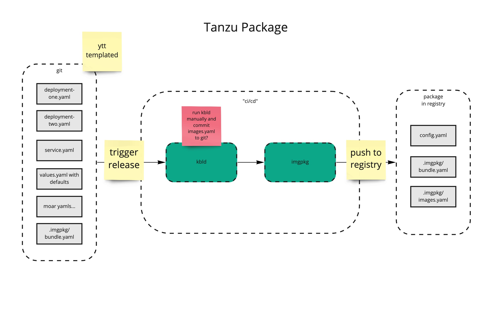

# TCE Extension Structure

TCE extensions enable TCE users to build application platforms atop Kubernetes.
TCE users can pick and choose which extensions they want to install onto their
TCE clusters.

## Goals

* Establish the structure of TCE extensions
* Establish the tooling used to build, package, and distribute TCE extensions

## Non-goals

* Define the consumption model of extensions
* Establish the packaging strategy of multiple extensions
* Establish the structure of a higher-level TCE repository

## High-level Design

The source code for TCE extensions are maintained in the TCE repository, under
the `extensions` directory.

Extensions are built using the [Carvel](https://carvel.dev/) toolkit and
distributed as OCI bundles.

The following diagram shows the use of the Carvel tools. This document further
describes this design in the following sections.



Each extension lives in a separate directory, named after the extension. The
extension directory contains the following:

* README: Contains the extension's documentation.
* config/: Contains the extension's deployment manifests, templated using ytt.
* config/.imgpkg: Contains `bundle.yaml` and `images.yaml` files.
* config/values.yaml: Contains the default values for ytt data values, where
  necessary.
* extension.yaml: Contains the kapp-controller App CRD.

For example, an extension named `foo` that includes two deployments and one
service would have the following structure:

```txt
./extensions/foo
├── README.md
├── config
├── ├── .imgpkg
├── ├── ├── bundle.yaml
├── ├── ├── images.yaml
├── ├── deployment-one.yaml
├── ├── deployment-two.yaml
├── ├── service.yaml
│   └── values.yaml
└── extension.yaml
```

## Detailed Design

### Extension's source code structure

The following sections provide more detail about each of the files/directories
that make up an extension.

#### README

The README.md file of each extension must have the following sections and answer
the following questions:

* **Components**: As a TCE user, what should I expect to be installed onto my
  cluster after installing the extension?
* **Configuration**: As a TCE user, what configuration parameters are available
  to me to tweak the extension?
* **Usage Example**: As a TCE user, how can I verify that the extension was
  installed successfully?

#### .imgpkg directory

Extensions are packaged using [imgpkg](https://carvel.dev/imgpkg/) and
[kbld](https://carvel.dev/kbld/). As such, each extension must contain an
`.imgpkg` directory with a `bundle.yaml` file and an `images.yaml` files.

The `bundle.yaml` file contains a `Bundle` resource which captures metadata
about the extension.

```yaml
apiVersion: imgpkg.carvel.dev/v1alpha1
kind: Bundle
metadata:
  name: my-bundle
authors:
- name: Full Name
  email: name@example.com
websites:
- url: example.com
```

The `images.yaml` file contains an `ImagesLock` resource. This file is generated
using `kbld` at release time to lock all container image references to their
respective SHAs.

Updating the `images.yaml` file is critical when bumping container image
versions in the extensions. Thus, the `images.yaml` file must be either:

a) Generated and committed into the source code repository as part of the CI
pipeline, or

b) Generated as part of the CI pipeline as a release gate. The gate blocks the
release if the file is different than the version that is checked into the
repository.

#### config directory

The config directory holds all the manifests necessary to deploy the extension
into a TCE cluster. These manifests typically contain Kubernetes Deployments,
Services, Roles/RoleBindings, Ingresses, etc.

The deployment manifests are templatized using ytt.

#### values.yaml

The `values.yaml` file within the config directory contains the ytt data values.
Each value should ideally have a default to provide an "out-of-the-box"
experience for TCE newcomers.

The `values.yaml` file should have inline documentation for each of the data
values. The documentation must be kept in sync with the `README.md` file of the
extension.

#### extension.yaml

The `extension.yaml` file contains the kapp-controller App CRD. The App CRD
specifies the `fetch`, `template`, and `deploy` stages as follows:

* `fetch`: Because extensions are bundled as OCI bundles, the `fetch` stage
  should use the `image` strategy.
* `template`: Extensions contain ytt templates and an `ImagesLock`. Thus, the
  `template` stage must first execute `ytt` to render the deployment manifests.
  Once rendered, the `template` stage must execute `kbld` to replace the
  container image tags with the corresponding sha256 references based on the
  `ImagesLock` file.
* `deploy`: The deploy stage must execute `kapp` to deploy the extension.

A typical `extension.yaml` should look as follows:

```yaml
apiVersion: kappctrl.k14s.io/v1alpha1
kind: App
metadata:
  name: some-extension
  namespace: tanzu-extensions
spec:
  syncPeriod: 5m
  serviceAccountName: some-extension-sa
  fetch:
    - image:
        url: projects.registry.vmware.com/tce/some-extension-templates:dev
  template:
    - ytt: 
        ignoreUnknownComments: true
        inline:
          pathsFrom:
            - secretRef:
                name: some-extension-data-values
    - kbld: {}
  deploy:
    - kapp:
        rawOptions: ["--wait-timeout=5m"]
```

### Ensuring All Container Images are Locked

To ensure all container image references are locked in the `ImagesLock`
configuration, image references must be specified in YAML instead of ytt data
values, functions, etc. In this way, kbld will "see" the image references and
include them in the images lock file.

There might be cases where specifying container image references in ytt data
values or inside ytt functions is necessary. In such cases, we will pre-render
the ytt templates before running kbld. In the worst case, we can produce the
ImagesLock file manually. With that said, these cases should be the exception,
and not the norm.

## Alternatives Considered

## Security Considerations

